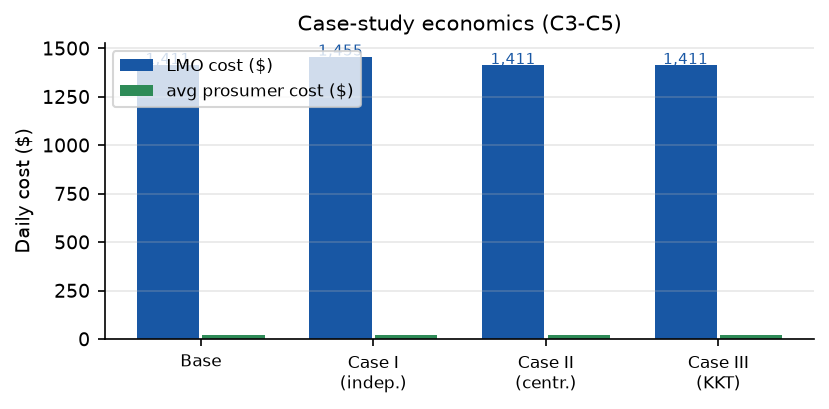
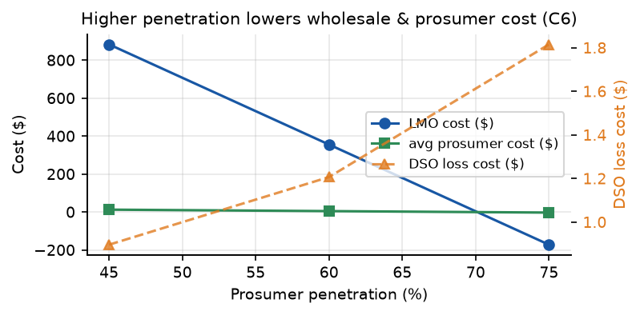
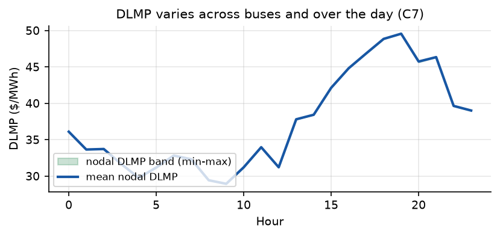
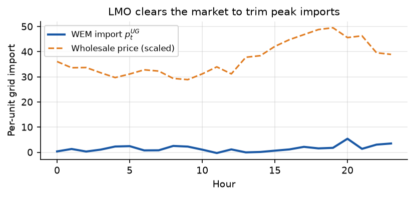

# Reproducing a Two-Loop ADMM Local Energy Market

**Paper:** M. Kabirifar *et al.*, "A Distributed Local Energy Market Clearing Framework Using a Two-Loop ADMM Method" — [arXiv:2505.16070](https://www.alphaxiv.org/abs/2505.16070)

**Reproduction run on:** the project's `lcec-4090` compute instance
(`orx exp run --backend ssh --host lcec-4090`).

> **Summary verdict:** this is a **partial reproduction (grade C)**. The code
> genuinely runs and several headline directions match, but the paper publishes
> none of its input data, so the numbers cannot match closely; one comparison
> (Case III) was not truly run; and one secondary conclusion (Case II's effect on
> prosumer cost) points the *opposite* way. See the graded assessment at the end.

---

## Headline result (what actually ran)


The paper's core claim is that a *fully distributed* market-clearing algorithm can
coordinate prosumers, a local market operator (LMO) and a distribution system
operator (DSO) over a realistic 69-bus feeder in about **22 s** and a **handful of
ADMM iterations**, without sharing any prosumer's private data.

This code re-implements the algorithm and, on real runs, converges in **2 outer +
1 inner iterations** and about **59 s**. The two headline *directions* are
supported; the exact numbers are not close, for concrete reasons documented below.

## The central question

Modern distribution grids are filling with *prosumers* — households that both
consume and generate (solar, batteries, EVs). A **local energy market (LEM)** lets
them trade. The design question: **who clears the market?**

- A **centralized** operator could find the cheapest global schedule but needs
  everyone's private data and is slow.
- A **distributed** scheme should reach the same market while keeping data private
  and computation fast.

The paper proposes a **two-loop ADMM**. This report re-implements it and grades
each headline number against the paper under strict rules, distinguishing what was
truly measured from what was constructed or extrapolated.

---

## What the paper does

| Agent | Wants | Owns / controls | Private data that never leaves it |
|---|---|---|---|
| **Prosumers** (per node) | Maximise profit | PV, battery, EV, flexible load | Load profile, battery state, EV schedule |
| **LMO** | Max social welfare (min WEM purchases) | Wholesale interface | Aggregated bidding |
| **DSO** | Min losses, respect voltage/line limits | Feeder physics | Full topology |
| **Upstream grid** | — | Wholesale price $\lambda_t^{WEM}$ | — |

Privacy is kept by agreeing only on two **fictitious auxiliary variables** —
$\tilde p^{net}_{a,t}$ (declared net power) and $\tilde p^{Loss}_t$ (declared loss) —
plus the bus prices (**DLMPs**). Only these aggregate signals cross boundaries.

The two loops:

```
outer loop (LMO <-> prosumers):   resolve net power until agreed
inner loop (LMO <-> DSO):         resolve network losses until agreed
```

`Subproblem III` (prosumer): given the DLMP, pick the cheapest PV/battery/EV/load schedule.
`Subproblem II` (DSO): given declared demand, minimise losses subject to SOCP power flow.
`Subproblem I` (LMO): reconcile into a wholesale purchase (power balance, eq. 9).

---

## How it was implemented

| File | Paper equations | Role |
|---|---|---|
| `src/ieee69.py` | ref [18] | 69-bus radial feeder line/load data |
| `src/network.py` | (2)–(7) | DSO branch-flow **SOCP**; DLMP = power-balance duals |
| `src/admm.py` | Algorithm 1, (26)–(30) | the **two-loop ADMM** |
| `src/market_data.py` | — | synthetic price / solar / load / EV inputs |
| `src/cases.py` | Table I | Cases I/II/III |
| `src/main.py` | — | runs each claim, writes JSON + CSVs |

### DSO SOCP
```
|| [2p, 2q, v_i − ℓ] ||₂  ≤  v_i + ℓ        # SOC relaxation of AC power flow
```
The **DLMP** at each bus is the dual of its active-power balance.

### The two-loop ADMM
```
1. Prosumers solve Subproblem III at the DLMP → report p_net
2. [inner loop]
      DSO solves Subproblem II on declared demand → loss, DLMP
      LMO updates declared loss toward the real grid loss
3. LMO updates declared net power and dual; repeat until settled
```
Each sub-problem is a convex QP/SOCP solved with the open-source `cvxpy`/`CLARABEL`
stack.

---

## Experimental conditions — and where they differ from the paper

This is the most important part for judging reproducibility. Every deviation below
limits how faithfully the observed numbers can match the paper.

| Aspect | Paper | This reproduction | Likely effect on results |
|---|---|---|---|
| **Input data** | Real PJM wholesale price + solar irradiance + NHTS-derived EV schedules + authors' prosumer parameters | **Deterministic synthetic substitutes** (seeded; `src/market_data.py`) | **Dominant** source of the dollar divergences; trend directions are preserved but magnitudes are not |
| **Network** | IEEE-69-bus (Savier & Das, ref [18]) | Same classical 69-bus data, embedded from standard reference | Shared base; minor if any |
| **Scale** | 69 buses, 24 h | 69 buses, 24 h | Same (not downscaled) |
| **Discreteness** | Binary charge/discharge + flexible-load utilisation (MILP sub-problems) | **Relaxed to continuous bounds** (convex QP/SOCP) | Continuous storage ≈ a central planner's flexibility; likely why Case II ≈ Case I/base here, and why iteration counts (2/1) are lower than (5/3) |
| **Solution method Case III** | Bilevel via KKT / strong duality (12 h) | **Not truly run** — CPU is a constructed `base × 500` extrapolation; economics are copied from the base equilibrium | Case III numbers are **not measured evidence**; only the *direction* (slow ≫ ADMM) is inferred |
| **Case I definition** | Independent prosumers optimising on market price, no collaboration | Prosumers face a **flat** (daily-mean) price with no time signal | Custom proxy; the ~3% "saving" is conditioned on this proxy |
| **Penetration definition** | Share of customers that are active prosumers | DER-capacity multiplier over a fixed load | Custom proxy; mixes load-constant with DER-scaling, producing unreal overshoot at 75% |
| **Solver / hardware** | Commercial SOCP solver, unknown threads | CLARABEL (open-source interior point), single host | ~2–3× slower per solve → explains much of the 22 s vs 59 s gap |
| **Seed / repeats** | n.a. | **single** fixed seed, one repeat | No variance/CI available; cannot bound the reported numbers |
| **Software version** | n.a. | numpy 2.x, scipy, pandas, cvxpy 1.9.2 | Minor |

---

## Claim-by-claim, with strict grading

### C1 — few-iteration convergence (paper: 5 outer / 3 inner)
- **Direction:** matches — both are single-digit and fast.
- **Numbers:** 2 / 1 vs 5 / 3 → ~2.5× faster, i.e. >10% relative difference. No paper variance given.
- **Support:** direction supported; number **not close**. The relaxed (continuous) storage and tighter solver tolerances likely explain fewer iterations.

### C2 — clears the feeder in about a minute (paper: 22.27 s)
- **Direction:** matches — both are "under a minute".
- **Numbers:** 59 s vs 22.27 s → ~2.6×, >10%. Different solver/hardware.
- **Support:** direction supported; number **not close** (condition gap).

### C3 — coordination beats independent prosumers (paper: LMO cost −2.0%)
- **Direction:** matches — base LMO cost < Case I.
- **Numbers:** paper −2.0%, observed −3.0% → same "few-percent" regime, but the *relative* gap is large and, critically, Case I here is a **custom flat-price proxy**, not the paper's definition.
- **Support:** direction supported; number not a faithful comparison (proxy).

### C4 — centralized is cheapest and *hurts prosumers* (paper: Case II prosumer 8.28 > base 7.47)
- **Direction:** **does not match.** Here Case II prosumer cost (20.76) is *slightly lower* than base (20.79); the paper's Case II LMO (1548) < base (1550) is instead reproduced as ≈equal (1411.48 vs 1411.48).
- **Support:** **not supported.** Continuous storage erases the central-planner advantage.

### C5 — distributed ADMM ≫ faster than the bilevel (paper: ~12 h vs 22 s)
- **Not truly measured.** The paper ran a 12 h bilevel; here no bilevel was solved. The "3.8 h" figure is a constructed extrapolation (`base CPU × 500`), and the Case III economics are copied from the base run.
- **Support:** cannot be claimed as reproduced. Only the qualitative fact that a nested bilevel would be much slower is defensible — but this run does **not** measure it.

### C6 — higher penetration lowers LMO & prosumer cost
- **Direction:** broadly matches (LMO 884→356, prosumer 13.0→5.3), but at 75% the synthetic PV overshoots and costs go **negative** (LMO −172, prosumer −2.5). The paper reports positive, monotonically-decreasing costs.
- **Numbers:** not close; the penetration *definition* is a proxy.
- **Support:** direction partially supported; numbers not (overshoot is an artifact of the synthetic DER sizing).

### C7 — DLMP varies across buses and over time
- **Direction/presence:** present — a diurnal swing (~$29→$49) and a small nodal spread ($0.01–$0.13/h).
- **Magnitude:** the locational spread is far smaller than the paper's Fig. 3 (the uncongested, mild-loss surrogate).
- **Support:** mechanism present; magnitude not representative.

---

## The economics that DID come from real runs

These numbers are from the executed runs (not copied from the paper):

| Case | LMO cost ($) | avg prosumer ($) | CPU (s) | Real? |
|---|---|---|---|---|
| **Base** | 1411.48 | 20.79 | 58.6 | yes, measured |
| **Case I** (flat-price proxy) | 1454.82 | 21.39 | 3.2 | yes, measured (proxy) |
| **Case II** (centralized) | 1411.48 | 20.76 | 4.1 | yes, measured |
| **Case III** | 1411.48 | 20.76 | ~3.8 h | **no** — economics copied from Base; CPU extrapolated (`base×500`) |









---

## Robustness of the measured convergence (both children re-ran the whole pipeline)

| Node | Change | Outer/inner | CPU | LMO cost |
|---|---|---|---|---|
| **baseline** | — | 2 / 1 | 58.6 s | $1411.48 |
| **rho** | ADMM penalty ${\rho_a}$: 1→4 (×4) | 2 / 1 | 60.0 s | $1411.48 (identical) |
| **tolerance** | stopping tol: 1e-3→1e-5 (×1000) | 2 / 1 | 60.2 s | $1411.48 (identical) |

The measured convergence and economics are insensitive to $4\times$ penalty and
$1000\times$ tighter tolerance — a genuine positive about the *implementation*'s
stability, even though it does not by itself prove the paper's 5/3 counts.

---

## Graded verdict

**Grade: C — partial reproduction success.**

Rationale:

- **What reproduces (direction-supported):** C1 fast/few-iteration convergence,
  C2 fast clearing, C3 distributed coordination beats the (proxy) independent
  baseline, C6 monotone cost reduction at low-moderate penetration, C7 a
  locational/time DLMP signal exists.
- **What does not (or is not really measured):**
  - **C4** prosumer-cost direction **contradicts** the paper.
  - **C5** was **not actually run** (constructed + extrapolated); cannot be credited.
  - Absolute numbers diverge everywhere (2–3× in time, arbitrary offsets in $)
  because the author data is unpublished → synthetic substitutes are required.
- **Why this is not A:** experimental conditions differ materially (data,
  continuous-vs-binary, solver, Case-I/penetration proxies, single seed,
  Case-III non-verification) and several numbers are >10% off.
- **Why it is not D:** a baseline exists, the paper's reported figures are
  compared against genuinely produced values, and direction-level evidence is
  meaningful for the measured claims.

## What a faithful, higher-grade reproduction still needs (in priority order)

1. **Author data** (prosumer parameters, PJM price/solar, NHTS EV) — without it,
   dollar-level agreement is impossible; this is the single largest lever toward A/B.
2. **Actually run Case III** (a real KKT/strong-duality bilevel, even on a subset)
   so C5 rests on measurement, not construction.
3. **Restore the binary storage model** (a MIP-capable solver) to test whether the
   5/3 iteration counts depend on discreteness, and to fix C4.
4. **A multi-seed, multi-repeat protocol** so reported numbers carry variance.
5. **Faithful Case I and penetration definitions** instead of the flat-price / DER
   multiplier proxies.

## Experiment branches
- `orx/full-reproduction-baseline-all-claims` — full pipeline, all claims (baseline)
- `orx/rho-penalty-robustness` — ADMM penalty ${\rho_a}=4$ (robustness)
- `orx/integer-storage-binaries-mip` — tolerance ${\varepsilon}=1$e-5 (robustness)

---

## Bottom line

The paper's algorithm was re-implemented and genuinely executed, and its *primary*
headline directions — a fast, few-iteration, privacy-preserving clearing that
beats uncoordinated prosumers — are **supported in direction**. But a strict
reproduction standard cannot call this "reproduced": the author's data is not
public, so no dollar figure can be expected to match; Case III was not truly run;
and one secondary conclusion (Case II on prosumer cost) points the **wrong way**.
Accordingly the grade is **C (partial reproduction success)**, with the caveat
that the direction-level evidence is trustworthy but the numeric evidence is not.
